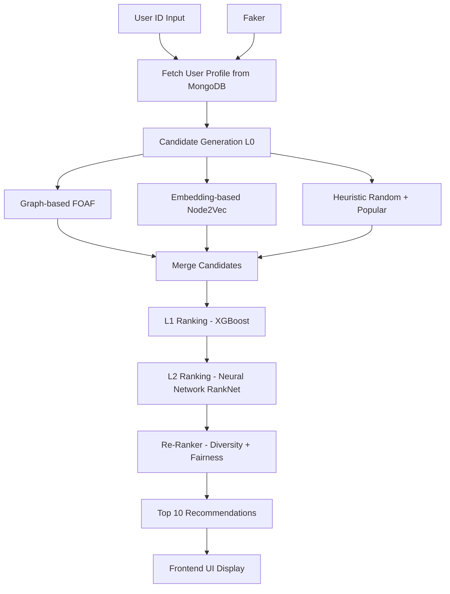

# LinkedIn-Style People You May Know


---

## Overview

* Graph relationships (mutual connections)
* Embedding similarity (Node2Vec)
* Heuristics (random + popular users)
* Machine Learning ranking (**XGBoost**)
* Deep Learning ranking (**Neural Network - RankNet**)
* Final diversity-aware re-ranking

---

## How It Works

When a user enters an ID (1–9999):

1. Fetch user profile from MongoDB
2. Run recommendation pipeline
3. Return **Top 10 recommended profiles**
4. Display them in a LinkedIn-style UI

---

## Recommendation Pipeline



---

## System Architecture

### Dataset

* Synthetic dataset generated using **Faker**
* 10,000 fake LinkedIn-style user profiles
* Stored in **MongoDB**
* Includes:

  * Name, title, company
  * Skills, connections
  * Avatar, bio, location

---

### Graph

* Built using `networkx`
* Model: Barabási–Albert Graph (scale-free network)
* Represents real-world social connections

---

### Candidate Generation (L0)

Sources:

* Friends-of-Friends (Graph)
* Node2Vec similarity
* Random + high-degree users

---

### L1 Ranking (Light Ranker)

* Model: **XGBoost**
* Features:

  * Mutual connections
  * Degree
  * Jaccard similarity

---

### L2 Ranking (Rich Ranker)

* Model: **Neural Network (RankNet)** using PyTorch
* Input:

  * Node embeddings (128-dim)

---

### Re-Ranking

* Ensures:

  * Diversity
  * Reduced redundancy
* Penalizes similar candidates

---

### Final Output

```python
def pymk(user):

    candidates = (_graph_candidates(G, user) + 
                  _embedding_candidates(user) + 
                  _heuristic_candidates(G, user))

    candidates = list(set(candidates))
    
    l1_res = _l1_rank(G, l1_model, user, candidates, neighbor_cache)

    l2_res = _l2_rank(l2_model, user, l1_res, emb_cache)

    final = _rerank_diversity(G, user, l2_res, neighbor_cache)

    return final
```
